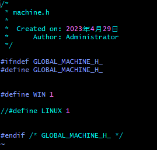
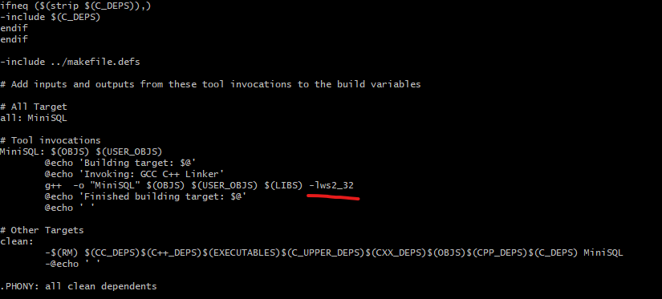

## change code

Windows:

global/machine.h 
	

	

Debug/makefile

	

Linux:

## build
make all --directory=Debug

## init database
change direcotry to Debug

MiniSQL.exe --initDB -D D:\\Studio\\MiniSQL\\test\\data  //windows

or 

./MiniSQL --initDB -D /
