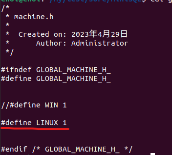
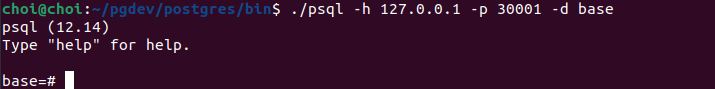
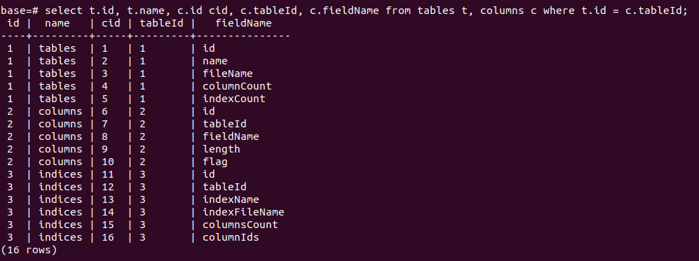
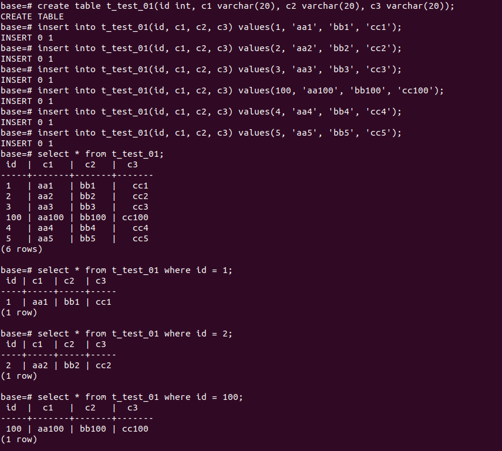
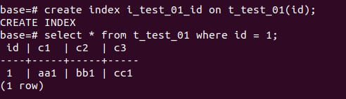

## change code

Windows:

global/machine.h 
	

	

Debug/makefile

	

Linux:

global/machine.h

	

## build
make all --directory=Debug

## init database
change direcotry to Debug

MiniSQL.exe --initDB -D D:\\Studio\\MiniSQL\\test\\data  //Windows

or 

./MiniSQL --initDB -D /home/choi/My/test/data  //Linux

## start server

MiniSQL.exe -P 30001 -D  D:\\Studio\\MiniSQL\\test\\data //Windows

or

./MiniSQL -P 30001 -D /home/choi/My/test/data

## test

with psql

./psql -h 127.0.0.1 -p 30001 -d base 

or

psql.exe -h 127.0.0.1 -p 30001 -d base 

	

	

	

	

